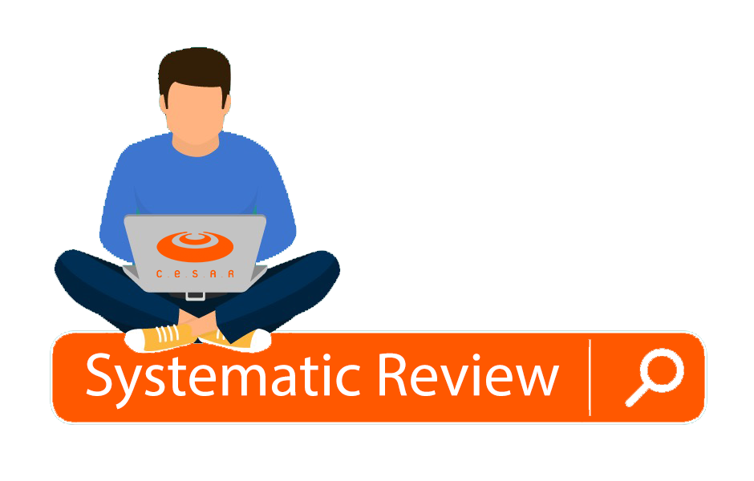

# Aula de Revisão Revisão Sistemática - Cesar School

Ambiente no qual será disponibilizado material da aula de Revisão Sistemática Métodos e Ferramentas.

> Professor: **[Luciano de Aguiar Monteiro](http://www.lucianoaguiar.com.br)** E-mail: lam@cesar.school
> 
> Professor: **[Washington Almeida](http://www.profwashingtonalmeida.com.br)** E-mail: whca@cesar.school

## Sumário

Slide Revisão Sistemática [Clique Aqui](manuscript/anexos/Slide_Systematic_Review.pdf)

IEEE xPlore[Appliance Samba](https://drive.google.com/open?id=1k_6UyI9RjKqrBUSAVVpLnftYZu6_9aI7) 